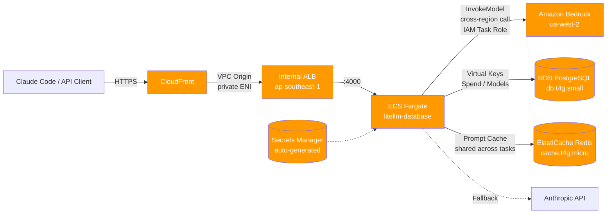

# LiteLLM + Bedrock Production Deployment

> 🌐 **English** · [简体中文](README.zh-CN.md)

Deploy [LiteLLM Proxy](https://docs.litellm.ai) on AWS to expose [Amazon Bedrock](https://aws.amazon.com/bedrock/) Claude 4.x models to [Claude Code](https://docs.anthropic.com/claude/docs/claude-code), with built-in Virtual Keys, budget tracking, usage analytics, and a Web UI.

**One-shot SAM deploy** → CloudFront → Internal ALB (VPC Origin) → ECS Fargate → Bedrock + RDS PostgreSQL + ElastiCache Redis.

> **Region model**: the gateway (CloudFront / ALB / ECS / RDS / Redis) defaults to `ap-southeast-1` (Singapore) for low-latency access in Asia. Bedrock model calls are pinned to `us-west-2` regardless of gateway region (configured in [`config.yaml`](config.yaml) via `aws_region_name`). Override the gateway region with `make deploy AWS_REGION=us-east-1`.



## ✨ Features

- **Zero-input deploy** — `make deploy` creates everything; master key & DB password auto-generated and surfaced in CFN Outputs
- **Zero public exposure** — ALB is `internal`; only reachable through CloudFront VPC Origin
- **Single-shot deploy** — one `sam deploy` command, no multi-phase or manual config upload
- **Web Admin UI** — log in to `/ui/` to add models, mint Virtual Keys, view usage
- **Persistent storage** — RDS PostgreSQL `db.t4g.small` (~170 connections) for Virtual Keys, Spend, Model config
- **Cross-task Prompt Cache** — ElastiCache Redis shared cache; survives scale-out, ~50% cost savings in benchmarks
- **Enterprise-compatible** — same image; pass `LITELLM_LICENSE` to unlock SSO / Audit / Custom branding
- **Auto-scaling** — ECS tasks scale 2-10 based on CPU 70% target
- **Multi-model** — Sonnet 4.6 / Opus 4.7 / Haiku 4.5 + Anthropic API fallback
- **Global edge** — CloudFront `PriceClass_All` by default; Asia Pacific / Oceania / South America served from nearest edge
- **Deletion protection** — RDS `DeletionProtection: true` to prevent accidental deletes

---

## 📁 File Layout

| File                                       | Purpose                                                                                                                                      |
| ------------------------------------------ | -------------------------------------------------------------------------------------------------------------------------------------------- |
| [`template.yaml`](template.yaml)           | AWS SAM/CloudFormation template (VPC, ALB, ECS, RDS, Redis, CloudFront, Lambda CustomResource)                                               |
| [`config.yaml`](config.yaml)               | LiteLLM config (model routing, cache, fallbacks, budget) — **embedded into `template.yaml`**; also mounted by `docker-compose` for local dev |
| [`docker-compose.yml`](docker-compose.yml) | Local dev (LiteLLM + PostgreSQL + Redis, mirrors prod architecture)                                                                          |
| [`.env.example`](.env.example)             | Environment variable template                                                                                                                |
| [`Makefile`](Makefile)                     | One-line deploy / test / inspect / destroy                                                                                                   |

---

## 🛠️ Make Cheat Sheet

All day-to-day operations go through `make`. Run `make help` for the full list:

| Command               | Purpose                                                                                 |
| --------------------- | --------------------------------------------------------------------------------------- |
| `make deploy`         | Deploy to AWS (auto-generates credentials on first run, idempotent on rerun)            |
| `make creds`          | Print URL + credentials in a table (CloudFront URL / UI URL / Master Key / DB Password) |
| `make status`         | Full stack status + all Outputs                                                         |
| `make get-url`        | Print just the CloudFront URL                                                           |
| `make test`           | Run a remote inference smoke test                                                       |
| `make logs`           | Tail ECS logs (last 5 min)                                                              |
| `make redeploy-tasks` | Force ECS task restart (pull new image / config)                                        |
| `make scale COUNT=5`  | Manually scale to N tasks                                                               |
| `make gen-keys`       | Generate a preset master key into `.env.deployed` (optional)                            |
| `make destroy`        | ⚠️ Tear down the stack (auto-disables RDS DeletionProtection first)                     |
| `make deploy-local`   | Local docker-compose stack (with PG + Redis)                                            |
| `make test-local`     | Local inference smoke test                                                              |
| `make logs-local`     | Local container logs                                                                    |
| `make clean-local`    | Clean local containers and volumes                                                      |

---

## 🚀 Quick Start

### 1. Prerequisites

```bash
brew install awscli aws-sam-cli jq    # required tools
aws configure                          # configure AWS credentials
```

IAM permissions needed: Bedrock + ECS + RDS + ElastiCache + CloudFront + Lambda + Secrets Manager + IAM.

### 2. Bedrock Model Access

In [AWS Console → Bedrock → Model access](https://us-west-2.console.aws.amazon.com/bedrock/home?region=us-west-2#/modelaccess) request and enable:

- `us.anthropic.claude-sonnet-4-6`
- `us.anthropic.claude-opus-4-7`
- `us.anthropic.claude-haiku-4-5-20251001-v1:0`

### 3. One-shot Deploy

```bash
make deploy        # ~15-20 minutes (CloudFront distribution is the slow part)
make creds         # show URL + credentials after deploy
```

The gateway is deployed to **`ap-southeast-1` (Singapore)** by default. To use a different region:

```bash
make deploy AWS_REGION=us-east-1
# or persist it in .env.deployed
echo 'AWS_REGION=us-east-1' >> .env.deployed && make deploy
```

The Bedrock model region is independent from the gateway region — models are always called at `us-west-2` via the `us.anthropic.*` cross-region inference profile (set in [`config.yaml`](config.yaml)). The IAM Task Role uses `arn:aws:bedrock:*:*:...` wildcards, so cross-region invocation works out of the box.

`make deploy` auto-generates the master key and DB password, stores them in Secrets Manager, and surfaces them via CFN Outputs. If `.env.deployed` exists with `LITELLM_MASTER_KEY` / `DB_PASSWORD` / `CLOUDFRONT_PRICE_CLASS`, those values take precedence.

CloudFront defaults to `PriceClass_All` (covers Asia Pacific, Oceania, South America). For NA/EU-only use `CLOUDFRONT_PRICE_CLASS=PriceClass_100` to lower cost.

`make creds` output:

```
╔═ LiteLLM Credentials ═════════════════════════════
+-------------------+--------------------------------------------+
|  CloudFrontURL    |  https://dXXXXXXXXXXXXX.cloudfront.net      |
|  UILoginURL       |  https://dXXXXXXXXXXXXX.cloudfront.net/ui/  |
|  LiteLLMMasterKey |  sk-XXXXXXXXXXXXXXXXXXXXXXXXXXXXXXXX        |
|  DBPassword       |  DbXXXXXXXXXXXXXXXXXXXXXXXX                 |
+-------------------+--------------------------------------------+
```

#### Custom credentials (optional)

```bash
make gen-keys      # generates a sk-prefixed random master key into .env.deployed
make deploy        # deploys using values from .env.deployed
```

---

## 🔌 Claude Code Integration

Run `make creds` to view credentials, then export environment variables:

```bash
export ANTHROPIC_BASE_URL=$(make -s get-url)
export ANTHROPIC_AUTH_TOKEN=<copy LiteLLMMasterKey from `make creds`>
export CLAUDE_CODE_DISABLE_EXPERIMENTAL_BETAS=1
claude --model claude-sonnet-4-6
```

Production tip: don't hand out the master key directly — mint a Virtual Key per user/team (see below).

---

## 🎛️ Admin UI

Open `<CloudFrontURL>/ui/`:

| Field    | Value                     |
| -------- | ------------------------- |
| Username | `admin`                   |
| Password | your `LITELLM_MASTER_KEY` |

The UI lets you:

- ✅ Add / edit / delete models (no need to touch `config.yaml` or restart)
- ✅ Mint Virtual Keys (with per-key budget / RPM / model allowlist / expiry)
- ✅ Create Teams / Users (multi-tenant isolation)
- ✅ View Spend / Usage / full request logs
- 🔒 SSO / Audit logs / Custom branding (Enterprise license required)

---

## 🔐 Virtual Keys (recommended)

Don't expose the master key — mint a per-user/team key instead:

```bash
# Create: sonnet-only, $50 monthly budget, 60 RPM
curl -X POST $ANTHROPIC_BASE_URL/key/generate \
  -H "Authorization: Bearer $LITELLM_MASTER_KEY" \
  -H "Content-Type: application/json" \
  -d '{
    "models": ["claude-sonnet-4-6"],
    "max_budget": 50,
    "budget_duration": "30d",
    "rpm_limit": 60,
    "metadata": {"team": "engineering"}
  }'
```

⚠️ **Note**: LiteLLM budget enforcement is **non-transactional** ("check before charge"). Under high concurrency, spend may exceed budget by a few percent. Production tips:

- Reserve a 20% buffer
- Combine with `rpm_limit` / `tpm_limit` as a hard guardrail

---

## 🔧 Updating `config.yaml`

`config.yaml` is **base64-embedded into the ECS Task Definition** at deploy time (see `CONFIG_YAML_BASE64` in [`template.yaml`](template.yaml)). This eliminates the S3 bootstrap step but means changes only land in running tasks after a new TaskDef revision is created.

### When to edit `config.yaml` vs the UI

| Change                                                | Where       | Takes effect            |
| ----------------------------------------------------- | ----------- | ----------------------- |
| Add / remove a model, tweak per-model params          | Admin UI    | Immediately (DB-backed) |
| Mint Virtual Keys, set per-key budget / RPM           | Admin UI    | Immediately             |
| Routing strategy, fallback chain, retries, timeouts   | config.yaml | After redeploy          |
| Cache backend (Redis / local), TTL                    | config.yaml | After redeploy          |
| Global budget, success / failure callbacks (Langfuse) | config.yaml | After redeploy          |

Rule of thumb: **dynamic state goes through the UI; routing / cache / observability policy goes through `config.yaml`**.

### How to apply a `config.yaml` change

```bash
# 1. Edit config.yaml locally
vim config.yaml

# 2. Redeploy — CFN diffs the TaskDef, registers a new revision, and rolls the ECS service
make deploy

# 3. Tail logs to watch the rollout (Ctrl-C when both new tasks are RUNNING)
make logs
```

`make deploy` is **idempotent** — if nothing besides `config.yaml` changed, only the TaskDef and ECSService get updated (~2-3 minutes, vs. ~15 minutes for a fresh stack).

### Rollout behavior

The ECSService has `MinimumHealthyPercent: 50` / `MaximumPercent: 200` plus a deployment circuit breaker. With the default `DesiredCount: 2`:

- ECS spins up 2 new tasks with the new TaskDef
- Waits for them to pass the ALB health check (`/health/liveliness`)
- Drains the 2 old tasks (30s deregistration delay on the target group)
- If new tasks fail to become healthy, the circuit breaker stops the rollout (existing tasks keep serving traffic — no rollback by default; check logs and fix forward)

In practice this is a **zero-downtime rolling update** — at least one healthy task is always serving traffic.

### Verifying the new config is live

```bash
# Confirm the active TaskDef revision bumped
aws ecs describe-services \
  --cluster litellm-claude-code-cluster \
  --services $(aws ecs list-services --cluster litellm-claude-code-cluster --query 'serviceArns[0]' --output text | xargs basename) \
  --query 'services[0].taskDefinition' --output text

# Smoke test through CloudFront
make test
```

### What about `make redeploy-tasks`?

`make redeploy-tasks` runs `update-service --force-new-deployment` — it restarts containers using the **same TaskDef**. Useful for picking up a new image tag (when `main-latest` upstream changes) but **does not pick up `config.yaml` edits**, because the base64 blob is baked into the TaskDef itself. Always use `make deploy` for config changes.

### Rollback

CloudFormation keeps prior TaskDef revisions. Fastest rollback:

```bash
git revert HEAD          # or: git checkout HEAD~1 config.yaml
make deploy
```

For an emergency point-in-time rollback without git, manually update the ECSService to a previous TaskDef revision in the AWS console — CFN will re-converge on the next `make deploy`.

---

## 💰 Cost Estimate (ap-southeast-1)

| Resource                            | Monthly           |
| ----------------------------------- | ----------------- |
| ECS Fargate 2× (1 vCPU / 2GB, 24/7) | ~$80              |
| ALB (internal)                      | ~$18              |
| NAT Gateway (single AZ)             | ~$36              |
| CloudFront (low traffic)            | ~$1               |
| RDS db.t4g.small 20GB gp3           | ~$30              |
| ElastiCache Redis cache.t4g.micro   | ~$15              |
| Secrets Manager (≥3 secrets)        | ~$1.50            |
| CloudWatch Logs                     | ~$3               |
| **Infrastructure subtotal**         | **~$185 / month** |

Plus Bedrock invocation cost in `us-west-2` (per-token, similar to direct Anthropic API). Cross-region traffic from `ap-southeast-1` → `us-west-2` for Bedrock calls is metered as inter-region data transfer; for typical Claude Code workloads this is a few dollars per month.

Redis-backed shared cache typically lifts prompt cache hit rate from **~30% → ~85%** in multi-task scenarios, often offsetting its monthly fee.

---

## 🏗️ Key Design Notes

### 1. CloudFront VPC Origin

ALB is fully private (`Scheme: internal`); CloudFront connects through the AWS-managed `CloudFront-VPCOrigins-Service-SG`. **The ALB is never exposed to the public internet.**

### 2. Lambda-discovered SG

`CloudFront-VPCOrigins-Service-SG` is auto-created by AWS the first time a VPC Origin is provisioned in a VPC. The template uses a Lambda CustomResource to look up its ID, then attaches a `SecurityGroupIngress` resource. Solves the chicken-and-egg dependency for fresh deploys.

### 3. Inline base64 config.yaml

The config file is base64-encoded into the TaskDef `CONFIG_YAML_BASE64` env var; the entrypoint decodes it to `/app/config.yaml`. Eliminates S3 bucket bootstrap and 2-phase deploy.

### 4. Synchronous Prisma startup

The container entrypoint runs `prisma db push` **before** `exec litellm`. Prevents async prisma + uvicorn from contending for limited CPU/memory during init (caused exit 137 / OOM in earlier iterations).

### 5. Wildcard IAM Secrets ARN

ExecutionRole uses `secretsmanager:GetSecretValue` on `arn:...:secret:${stack}/*` instead of `!Ref` — avoids race conditions where CFN updates TaskDef before refreshing the IAM policy with the new Secret ARN suffix.

### 6. Cross-task Prompt Cache

ElastiCache Redis replaces the default `local` cache. `cache_params.type: redis` + Redis Endpoint env vars are injected into containers. Any task can hit the same cache, preventing hit-rate collapse during scale-out.

---

## 🔄 Upgrade to LiteLLM Enterprise

Apply for a [LiteLLM Enterprise License](https://www.litellm.ai/), then add it to `.env.deployed`:

```bash
echo 'LITELLM_LICENSE_KEY=sk-litellm-license-xxxx' >> .env.deployed
make deploy
```

Same image; the `LITELLM_LICENSE` env var unlocks: SSO (Okta / Azure AD / Google), Audit logs, Prompt management UI, Custom branding, JWT integration, Email alerts.

---

## 🧪 Local Development

`docker-compose.yml` runs LiteLLM + PostgreSQL + Redis, mirroring production (same image, same entrypoint, same DB / cache interface).

```bash
cp .env.example .env             # fill in LITELLM_MASTER_KEY and AWS credentials
make deploy-local                # docker-compose up -d
make test-local                  # smoke test
make logs-local                  # follow logs
# UI: http://localhost:4000/ui/  (admin / $LITELLM_MASTER_KEY)
make clean-local                 # cleanup
```

---

## 🗑️ Destroy

```bash
make destroy
```

`make destroy` automatically disables RDS DeletionProtection, then runs `delete-stack` and waits for completion.

Note: RDS uses `DeletionPolicy: Snapshot` so a final snapshot is retained on delete. To fully clean up, manually delete the snapshot afterward.

---

## 📚 References

- [LiteLLM Docs](https://docs.litellm.ai)
- [CloudFront VPC Origins Announcement](https://aws.amazon.com/blogs/networking-and-content-delivery/introducing-cloudfront-virtual-private-cloud-vpc-origins-shield-your-web-applications-from-public-internet/)
- [Amazon Bedrock User Guide](https://docs.aws.amazon.com/bedrock/latest/userguide/)
- [Claude Code](https://docs.anthropic.com/claude/docs/claude-code)

---

## ⚠️ Known Limitations / TODO

### Production hardening (+~$50/month)

- [ ] **RDS Multi-AZ** (single-AZ is still a SPOF; required for transactional workloads)
- [ ] **Dual-AZ NAT Gateway** (single NAT is still a SPOF)
- [ ] **Pin image tag** (currently `main-latest` may silently change upstream)
- [ ] **Critical alarms** — ALB 5xx / Bedrock Throttle / RDS Connections + SNS

### Security / Compliance

- [ ] CFN Outputs return credentials in plaintext; for multi-team setups switch to ARN-only outputs
- [ ] No WAF (a public LLM gateway should add AWS WAF for abuse / DDoS protection)
- [ ] No custom domain / TLS cert (uses CloudFront default `*.cloudfront.net`)

### Other

- [ ] Redis is single-node; for HA switch to `AWS::ElastiCache::ReplicationGroup` with a replica

PRs welcome.
