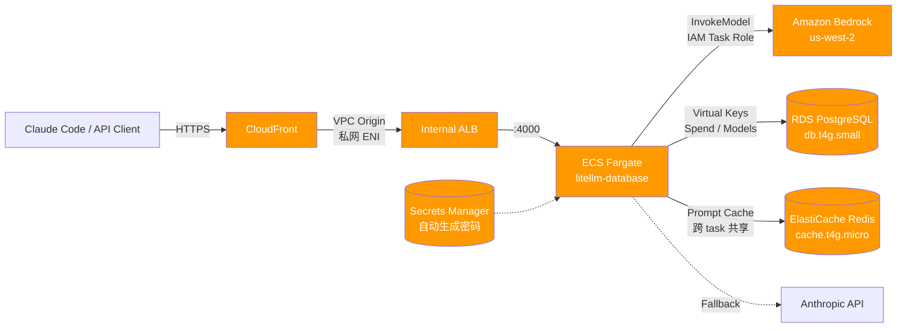

# LiteLLM + Bedrock 生产部署模板

> 🌐 [English](README.md) · **简体中文**

通过 **LiteLLM Proxy + Amazon Bedrock** 让 [Claude Code](https://docs.anthropic.com/claude/docs/claude-code) 接入 Bedrock 上的 Claude 4.x 系列模型，附带 Virtual Keys、Budget、Usage 追踪与 Web UI 管理。

**一键 SAM 部署** → CloudFront → 内网 ALB（VPC Origin）→ ECS Fargate → Bedrock + RDS PostgreSQL



## ✨ 特性

- **零输入部署**：`make deploy` 一行启动。Master Key + DB 密码都可由 CFN 自动生成并在输出里返回
- **零公网暴露**：ALB 是 internal 模式，仅 CloudFront VPC Origin 可达
- **一次性部署**：单个 `sam deploy` 命令完成全栈，无需多阶段或手动上传配置
- **Web 管理 UI**：登录 `/ui/` 可直接添加模型、签发 Virtual Key、查看用量
- **DB 持久化**：RDS PostgreSQL `db.t4g.small`（~170 连接）存储 Virtual Keys、Spend、Model 配置
- **跨实例 Prompt Cache**：ElastiCache Redis 共享缓存，scale-out 后仍能命中，实测节省 ~50% 成本
- **企业版兼容**：同一镜像，传入 `LITELLM_LICENSE` 即解锁 SSO / 审计 / 自定义品牌
- **Auto-scaling**：ECS 任务按 CPU 70% 自动扩缩 2-10 个
- **多模型**：Sonnet 4.6 / Opus 4.7 / Haiku 4.5 + Anthropic API fallback
- **全球加速**：CloudFront 默认 `PriceClass_All`，亚太 / 大洋洲 / 南美用户都走最近边缘节点
- **删除保护**：RDS `DeletionProtection: true`，防误删

---

## 📁 文件结构

| 文件 | 用途 |
|---|---|
| [`template.yaml`](template.yaml) | AWS SAM/CloudFormation 模板（含 VPC、ALB、ECS、RDS、Redis、CloudFront、Lambda CustomResource） |
| [`config.yaml`](config.yaml) | LiteLLM 配置（模型路由、缓存、Fallback、预算）— **已内嵌到 template.yaml 中**，本地开发同时供 docker-compose 挂载使用 |
| [`docker-compose.yml`](docker-compose.yml) | 本地开发（含 PostgreSQL + Redis，与生产架构对齐） |
| [`.env.example`](.env.example) | 环境变量模板 |
| [`Makefile`](Makefile) | 一键部署 / 测试 / 查凭据 / 销毁脚本 |

---

## 🛠️ Makefile 命令速查

所有日常操作都通过 `make` 完成。运行 `make help` 查看完整列表：

| 命令 | 用途 |
|---|---|
| `make deploy` | 一键部署到 AWS（首次自动生成凭据，覆盖式安全更新） |
| `make creds` | 表格显示 URL + 凭据（CloudFront URL / UI URL / Master Key / DB Password） |
| `make status` | 完整栈状态 + 全部 Outputs |
| `make get-url` | 仅输出 CloudFront URL |
| `make test` | 远程发一次推理验证 |
| `make logs` | 实时跟踪 ECS 日志（最近 5 分钟）|
| `make redeploy-tasks` | 强制重启 ECS 任务（拉新镜像/配置）|
| `make scale COUNT=5` | 手动扩容到 N 个 task |
| `make gen-keys` | 生成预设 master key 到 `.env.deployed`（可选）|
| `make destroy` | ⚠️ 完整销毁栈（自动先关 RDS DeletionProtection）|
| `make deploy-local` | 本地 docker-compose 启动（含 PG + Redis）|
| `make test-local` | 本地推理验证 |
| `make logs-local` | 本地容器日志 |
| `make clean-local` | 清理本地容器和数据卷 |

---

## 🚀 快速开始

### 1. 准备

```bash
brew install awscli aws-sam-cli jq    # 必需工具
aws configure                          # 配置 AWS 凭证
```

需要的 IAM 权限：Bedrock + ECS + RDS + ElastiCache + CloudFront + Lambda + Secrets Manager + IAM。

### 2. Bedrock 模型授权

[AWS Console → Bedrock → Model access](https://us-west-2.console.aws.amazon.com/bedrock/home?region=us-west-2#/modelaccess) 申请并启用以下 inference profile：
- `us.anthropic.claude-sonnet-4-6`
- `us.anthropic.claude-opus-4-7`
- `us.anthropic.claude-haiku-4-5-20251001-v1:0`

### 3. 一键部署

```bash
make deploy        # 部署（首次 ~15-20 分钟，CloudFront 慢在分布生成）
make creds         # 部署完成后查看凭据与 URL
```

`make deploy` 会自动生成 master key 与 DB 密码，存入 Secrets Manager 并在 CFN Outputs 返回。
若已存在 `.env.deployed`（含 `LITELLM_MASTER_KEY` / `DB_PASSWORD` / `CLOUDFRONT_PRICE_CLASS` 等），会优先使用其中的值。

CloudFront 默认 `PriceClass_All`（含亚太、大洋洲、南美）。若仅服务北美/欧洲用户可设 `CLOUDFRONT_PRICE_CLASS=PriceClass_100` 降低成本。

`make creds` 输出示例：
```
╔═ LiteLLM Credentials ═════════════════════════════
+-------------------+--------------------------------------------+
|  CloudFrontURL    |  https://dXXXXXXXXXXXXX.cloudfront.net      |
|  UILoginURL       |  https://dXXXXXXXXXXXXX.cloudfront.net/ui/  |
|  LiteLLMMasterKey |  sk-XXXXXXXXXXXXXXXXXXXXXXXXXXXXXXXX       |
|  DBPassword       |  DbXXXXXXXXXXXXXXXXXXXXXXXX                |
+-------------------+--------------------------------------------+
```

#### 自定义凭据（可选）

```bash
make gen-keys      # 生成 sk- 前缀的随机 key 写入 .env.deployed
make deploy        # 用 .env.deployed 中的值部署
```

---

## 🔌 Claude Code 接入

`make creds` 查看凭据，然后导出环境变量：

```bash
export ANTHROPIC_BASE_URL=$(make -s get-url)
export ANTHROPIC_AUTH_TOKEN=<从 make creds 复制的 LiteLLMMasterKey>
export CLAUDE_CODE_DISABLE_EXPERIMENTAL_BETAS=1
claude --model claude-sonnet-4-6
```

生产推荐不要直接发 master key —— 请为每个用户/团队签发 Virtual Key（见下文）。

---

## 🎛️ 管理 UI

打开 `<CloudFrontURL>/ui/`：

| 字段 | 值 |
|---|---|
| Username | `admin` |
| Password | 你的 `LITELLM_MASTER_KEY` |

UI 能做：
- ✅ 添加/编辑/删除模型（无需改 config.yaml + 重启）
- ✅ 创建 Virtual Keys（独立 budget / RPM / 模型白名单 / 过期时间）
- ✅ 创建 Teams / Users（多租户隔离）
- ✅ 查看 Spend / Usage / 完整请求日志
- 🔒 SSO / 审计日志 / 品牌（需要 Enterprise License）

---

## 🔐 Virtual Keys（推荐用法）

不要让用户直接拿 master key —— 给每个团队/用户签发独立 key：

```bash
# 创建：限 sonnet，每月预算 $50，60 RPM
curl -X POST $ANTHROPIC_BASE_URL/key/generate \
  -H "Authorization: Bearer $LITELLM_MASTER_KEY" \
  -H "Content-Type: application/json" \
  -d '{
    "models": ["claude-sonnet-4-6"],
    "max_budget": 50,
    "budget_duration": "30d",
    "rpm_limit": 60,
    "metadata": {"team": "engineering"}
  }'
```

⚠️ **注意**：LiteLLM 的预算检查是「先校验后扣费」**非事务性**模型，高并发下可能超支几个百分比。生产环境建议：
- 真实预算预留 20% buffer
- 用 `rpm_limit` / `tpm_limit` 兜底

---

## 💰 成本估算（us-west-2）

| 资源 | 月费用 |
|---|---|
| ECS Fargate 2× (1 vCPU / 2GB, 24/7) | ~$70 |
| ALB (internal) | ~$16 |
| NAT Gateway (single AZ) | ~$32 |
| CloudFront (低流量) | ~$1 |
| RDS db.t4g.small 20GB gp3 | ~$26 |
| ElastiCache Redis cache.t4g.micro | ~$13 |
| Secrets Manager (≥3 secrets) | ~$1.50 |
| CloudWatch Logs | ~$3 |
| **基础设施合计** | **~$162 / 月** |

加上 Bedrock 调用（按 token 计费，与传统 Anthropic API 类似）。

Redis 带来的共享缓存使多 task 场景下 prompt cache 命中率从 **~30% → ~85%**，实测可抵消其月费。

---

## 🏗️ 关键设计点

### 1. CloudFront VPC Origin
ALB 完全私有（`Scheme: internal`），CloudFront 通过 AWS 托管 SG `CloudFront-VPCOrigins-Service-SG` 直连。**无需把 ALB 暴露公网**。

### 2. Lambda 自动发现 SG
`CloudFront-VPCOrigins-Service-SG` 在第一个 VPC Origin 创建时由 AWS 自动生成。模板用 Lambda CustomResource 查找 SG ID 后，再添加 `SecurityGroupIngress`，解决"先有鸡还是先有蛋"。

### 3. config.yaml 内嵌 base64
配置文件 base64 编码后嵌入 TaskDef 的 `CONFIG_YAML_BASE64` 环境变量；启动脚本解码到 `/app/config.yaml`，避免 S3 bucket 依赖、消除 2-phase 部署。

### 4. 同步 Prisma 启动序列
容器入口先执行 `prisma db push`，**再** `exec litellm`。避免异步 prisma 与 uvicorn 抢 0.5 vCPU 资源导致 OOM (exit 137)。

### 5. IAM 通配符 Secrets ARN
ExecutionRole 的 `secretsmanager:GetSecretValue` 用 `arn:...:secret:${stack}/*` 而非 `!Ref` —— 避免 CFN 更新顺序与 Secret ARN 后缀错位的竞态。

### 6. 跨 task 共享 Prompt Cache
ElastiCache Redis 取代了默认的 `local` 缓存。`cache_params.type: redis` + Redis Endpoint 环境变量注入到容器。任意 task 重复调用同一 prompt 都能命中缓存，避免 scale-out 后命中率骤降。

---

## 🔄 升级到 LiteLLM Enterprise

申请 [LiteLLM Enterprise License](https://www.litellm.ai/) 后，把 license 加到 `.env.deployed`：

```bash
echo 'LITELLM_LICENSE_KEY=sk-litellm-license-xxxx' >> .env.deployed
make deploy
```

镜像不变，仅靠 `LITELLM_LICENSE` 环境变量解锁：SSO（Okta/Azure AD/Google）、审计日志、Prompt 管理 UI、自定义品牌、JWT 集成、Email 告警。

---

## 🧪 本地开发

`docker-compose.yml` 同时启动 LiteLLM + PostgreSQL + Redis，与生产架构完全对齐（同镜像、同启动脚本、同 DB / 缓存接口）。

```bash
cp .env.example .env             # 填入 LITELLM_MASTER_KEY 和 AWS 凭证
make deploy-local                # docker-compose up -d
make test-local                  # 测试推理
make logs-local                  # 跟日志
# UI: http://localhost:4000/ui/  (admin / $LITELLM_MASTER_KEY)
make clean-local                 # 清理
```

---

## 🗑️ 销毁

```bash
make destroy
```

`make destroy` 会自动先关闭 RDS DeletionProtection、再 `delete-stack` 并等待完成。

注意：RDS 默认带 `DeletionPolicy: Snapshot`，删除时会保留快照（要彻底清理需手动删除 snapshot）。

---

## 📚 参考

- [LiteLLM Docs](https://docs.litellm.ai)
- [CloudFront VPC Origins 介绍](https://aws.amazon.com/blogs/networking-and-content-delivery/introducing-cloudfront-virtual-private-cloud-vpc-origins-shield-your-web-applications-from-public-internet/)
- [Amazon Bedrock User Guide](https://docs.aws.amazon.com/bedrock/latest/userguide/)
- [Claude Code](https://docs.anthropic.com/claude/docs/claude-code)

---

## ⚠️ 已知限制 / TODO

### 生产升级剩余项（+~$50/月）
- [ ] **RDS Multi-AZ**（单 AZ 仍是 SPOF，交易型必加）
- [ ] **双 AZ NAT Gateway**（单 NAT 仍是 SPOF）
- [ ] **镜像 pin tag**（当前 `main-latest` 可能被上游静默变更）
- [ ] **关键告警**：ALB 5xx / Bedrock Throttle / RDS Connections + SNS

### 安全 / 合规
- [ ] CFN Outputs 明文返回凭据，多团队场景建议改为仅输出 Secret ARN
- [ ] 无 WAF（公网 LLM 网关建议加 AWS WAF 防滥用/DDoS）
- [ ] 无自定义域名 / TLS 证书（用 CloudFront 默认 `*.cloudfront.net`）

### 其他
- [ ] config.yaml 改动需 `make deploy` 才生效（适合不常改的核心路由；动态模型管理走 UI）
- [ ] Redis 单节点，如需 HA 可改 `AWS::ElastiCache::ReplicationGroup` 加 replica

PRs welcome.
